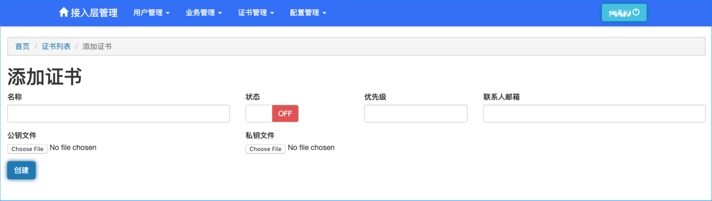
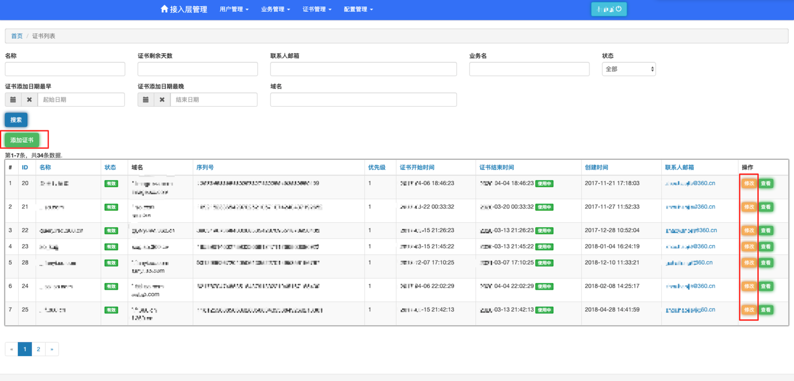
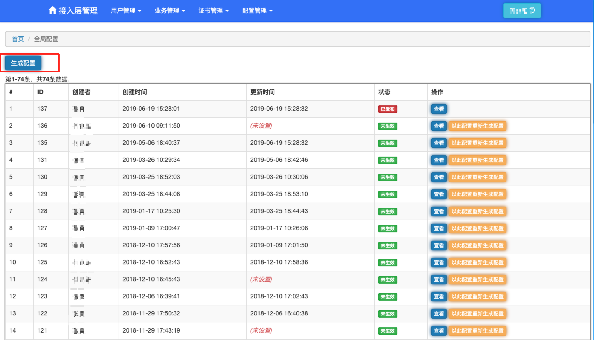
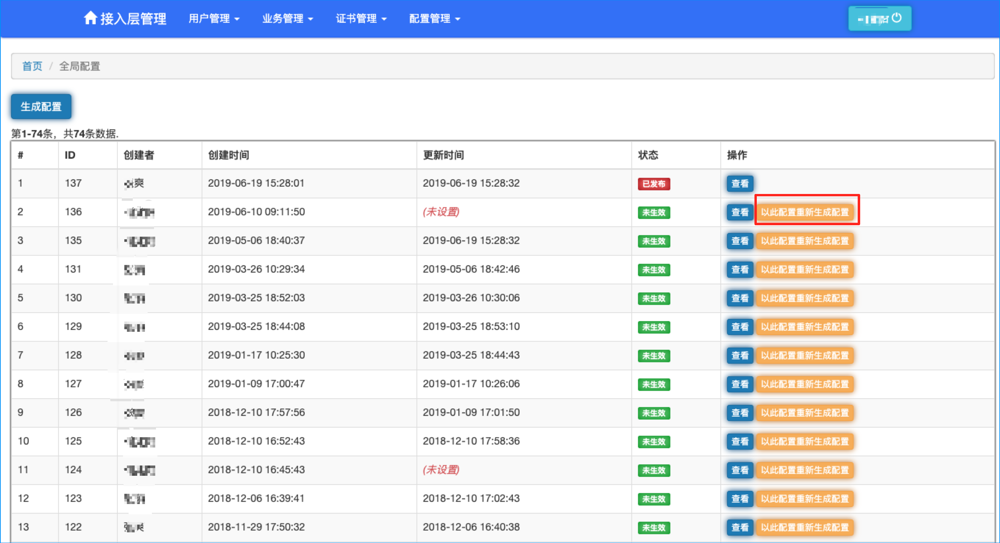

## 证书配置

接入层后台提供统一证书管理，添加之后，之后进行”业务配置“时可以将业务和证书进行关联。

### 添加证书

需要先准备好证书文件，包括公钥文件（\*.key）和私钥文件（\*.crt），然后后台进入“证书管理-证书列表”菜单，通过页面中的“添加”按钮进行证书添加。

如下图将准备好的公钥和私钥文件进行上传，上传成功而且文件能正常解析的话，程序将自动的解析证书信息，包括证书开始结束时间、域名、序列号、颁发者等基本信息。

### 修改证书

证书过期后，需要更新证书信息，可以点击证书列表中每行最后的”修改“按钮，重新上传证书公钥和私钥文件，和添加证书一样，也会自动解析证书的基本信息。

## 配置发布

配置将用于接入层前台程序，是一段 json 字符串，前台通过 openresty 的 init 阶段定时从后台的配置接口拉取已经正式发布的配置。

配置中包括业务的基本信息、负载均衡信息、证书信息等。

后台提供两个获取配置的接口，一个是获取正式环境配置的接口，一个是获取预发布环境配置的接口。

#### 生成配置

在添加完项目之后，后台点击进入“配置管理-配置信息”，点击“生成配置”按钮，会根据当前系统中所有项目的配置，生成一份新的配置。

### 预发布

生成配置之后，为了避免错误配置对线上环境造成影响，需要对生成的配置先进行回归测试，此时需要将配置进行“预发布”。

“预发布”按钮在“对比线上配置”界面最上方，需要仔细确认新生成的配置和线上的差别之后再进行预发布。

预发布后的配置，只能通过获取预发布环境的接口获取最新配置。

### 发布
**只有预发布之后的配置，才可以进行发布。**将配置预发布到回归环境测试通过之后，需要进行“发布”操作，发布操作即将配置生效于所有线上机器，线上程序通过接口可以获取到发布后的最新配置。

### 回滚
为了避免上线带来的致命错误，平台支持将配置回滚到任一个发布过的版本。

回滚操作即将配置恢复到之前线上的某个版本。

点击版本后方"以此配置重新生成配置"按钮后，并重新发布即可。

## 常见问题

