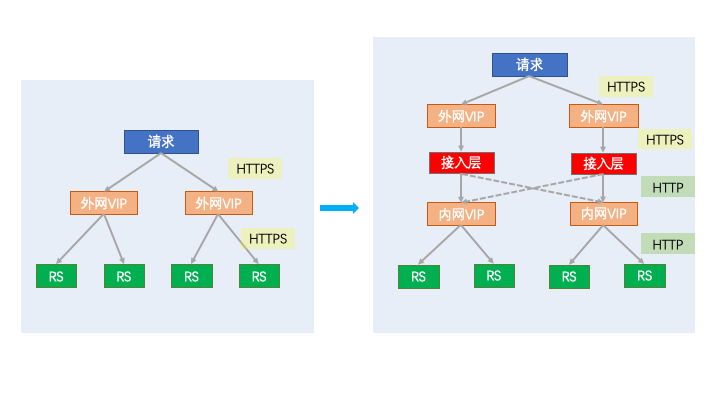

# 简介

## 项目背景

近年来，基于安全性上的考虑，360搜索逐渐将各个HTTP的业务迁移到HTTPS上，
但由于360搜索业务线众多，将每个业务都做一遍HTTPS迁移的事情就显得过于繁琐，
于是HTTPS接入层应运而生。

## 实现功能

究其本质，就是在业务本身的LVS之上增加一个专做HTTPS卸载的逻辑层，这样业务方不需要自己来做HTTPS及证书配置等相关的工作，
只需要接入层这个逻辑层，就可以完成HTTPS的卸载，从而接入HTTPS。

HTTPS卸载的过程可以参考下图

图中可见，原本需要在真实业务的RS上才能做到的HTTPS卸载工作，经过接入层后，可以在这个逻辑层，就将HTTPS协议卸载称HTTP协议

此外，图中的虚线部分为本项目实现的另外一个功能，负载均衡，接入层的接到的流量在做完HTTPS卸载后，可以按照权重转发给不同的内网VIP，便于做流量的切换迁移。

这些就是接入层的最核心的两个功能：HTTPS卸载和负载均衡。

## 目前在360搜索使用的情况

目前360搜索有大约20个大中型业务接入层本系统中，总峰值QPS在120K以上。

