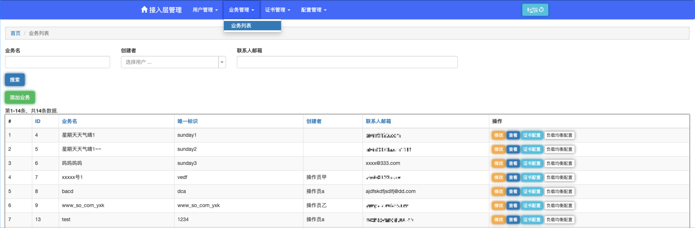
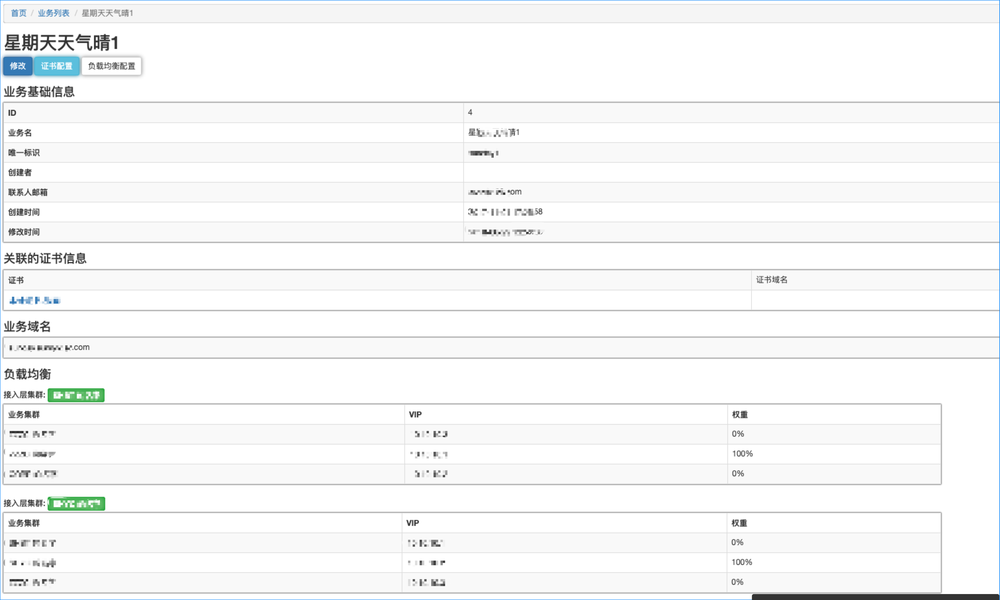
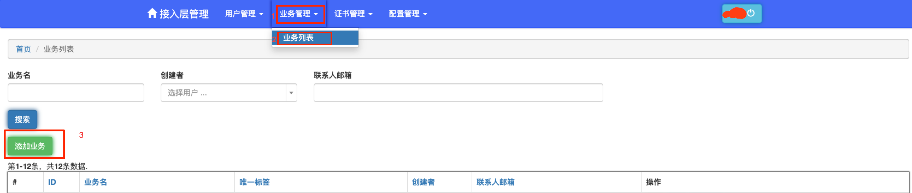
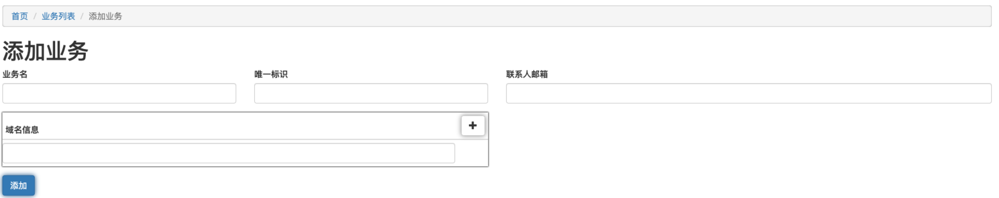
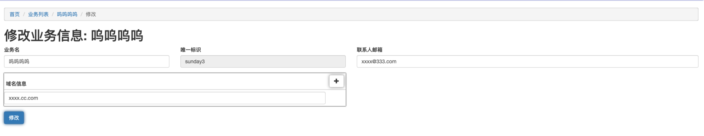
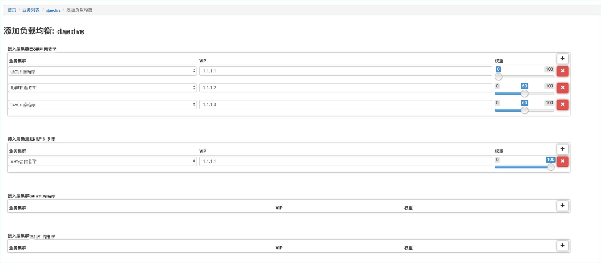

# 业务管理

本节主要介绍当有一个新的业务，在业务自身的功能开发完成后，
如何在这个后台创建这个业务，并依次配置该业务的`基本信息`,`证书关联`,`负载均衡配置`

`业务管理` - `业务列表` 即可进入到业务管理的主界面。

该页面下提供如下功能

* 搜索
    * 支持针对`业务名`, `创建者`,`联系人邮箱` 的过滤搜索。
* 添加
    * 添加一个新业务
* 查看
    * 查看某个业务当前的基本信息，证书配置信息，负载均衡配置信息
* 修改
    * 更改业务的基本信息
* 证书关联
    * 为业务关联一张或者多张https证书
* 负载均衡配置
    * 配置接入层到后端真实业务的业务流量的负载均衡
    
    
---

## 查看业务详情

通常一个完整配置好的业务详情如下：

包括如下信息

### 业务基础信息

* `ID`- 业务在数据库中的主键id
* `业务名` - 该业务的业务名称
* `唯一标识` - 每个业务均需要有一个唯一标识，系统中全局唯一。
* `创建者` - 该业务的创建者
* `联系人邮箱` - 该业务真实服务的负责人的邮箱。
* `创建时间` - 该业务基础信息的首次创建的时间
* `修改时间` - 该业务基础信息最近一次修改的时间

### 关联的证书信息

这里列出了一个业务所关联的证书，这些证书需要先在`证书管理`中配置完成, 点击证书名称，可以查看该证书的详情。

### 业务的域名

这里列出的是配置的业务的域名，配置时应该确保，这些域名都有对应的证书，且满足对应证书的解析规则。

### 负载均衡信息

这里将列出所有集群的负载均衡信息。
接入层的集群是指当前接入层前台部署的机器所在的集群，工作时，将会由这些实例将接收到的流量，按照配置的比例转发给不同的后端业务所在的集群。

---

## 基础信息配置

本节主要介绍，如何在这个后台管理工具中创建一个新业务，并配置上这个业务的一些基本信息。

### 创建业务

登入到本系统后，依次点击`业务管理` - `业务列表` - `添加业务`， 进入到添加业务的页面

请按照真实情况配置如下项：

* 业务名：你可以给这个业务起一个具有辨识度的名字,业务名需要全局唯一
* 唯一标识：支持英文数字和下划线，业务需要有一个全局唯一的标识，且`一旦配置过即不可更改`，应短小精悍，最好在20个字符内，如：一个天气业务可以取名为`BIZ_WEATHER`。
* 联系人邮箱：这个邮箱不一定是本系统的用户，需要指定为该业务的对接人，可以是系统之外的任何人。
* 域名信息：业务用到的域名，如果是多个，可以通过点击右侧`+` 配置多个。不能配置其他业务已经使用的域名。

以上全部配置完成后点击 `添加` 按钮，即可完成配置。

### 修改业务

通过在 `业务管理` - `业务列表` 点击`修改` 按钮，进入到业务的基本信息修改页面，
在这里你可以按照`创建业务`时的填写规则来更新业务的基本信息，
要注意，`唯一标识` 只能在创建时配置，这里不支持修改。

---

## 关联证书配置

通过在 `业务管理` - `业务列表` 下，点击 `证书配置` 进入到证书配置的页面

选择该业务域名对应的证书即可。

配置完成后 点击添加即可完成关联证书配置。

注意可选的证书需要现在`证书管理` 中配置完成。

---

## 负载均衡配置

通过在 `业务管理` - `业务列表` 下，点击 `负载均衡配置` 进入到负载均衡配置的页面

接入层可能部署在多个集群下，业务也会部署在多个集群下，

这样就需要配置，每个接入层集群接收到的流量，需要按照怎样的比例转发给后端的真实业务。

    理想状态下，接入层的集群和后端真实业务在同一个地区的同机房集群，
    那么常理上，只需要 在业务对应的集群的vip下配置100%的流量就可以了。
    但考虑到偶发的需要切换流量的情况，就需要将业务的其他集群vip也配置上，权重配置为0，
    一旦发生意外，只需要更改权重，再发布就可以了。

* 接入层集群XXXXX ，代表接入层所在的集群
* 业务集群， 代表真实业务所在的集群，
* VIP， 代表真实业务的vip地址
* 权重，取值：0-100，代表接入层的流量百分之多少会转发到这个vip上， 注意同接入层集群下各个业务集群的权重配置和为100。

全部配置完成后点击 页面最下方的`确认` 配置完成.

注意：此时并没有在线上生效，需要到`配置管理` 中完成生成配置，并发布配置的过程，才会在线上生效。

