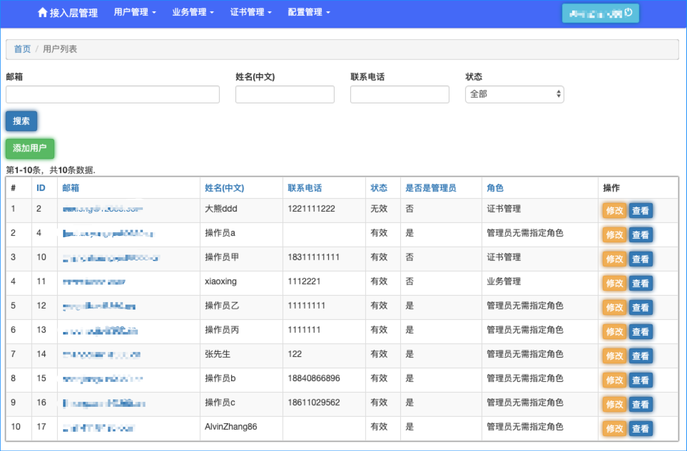

#  用户管理

本系统的业务分为多个模块，由多个角色的用户协同管理, 可以参考下表

| 角色 | 特征 | 可管理模块|
|---- | ---- | ---- |
| 管理员 | is_admin = 1 | 全部(包括 用户管理，证书管理，业务管理，配置发布) |
| 证书管理人员 | role_id = 1 | 证书管理 |
| 业务管理人员 | role_id = 2 | 业务管理 |
| 业务证书发布管理人员 | role_id = 3 | 证书管理，业务管理，配置发布 |

## 第一位管理员

第一位管理员需要手动设置， 请在登录后，手动更改数据库表 user, 对应用户的is_admin = 1;

## 详细操作

### 用户列表

点击 `用户管理` - `用户列表` 可以展示当前注册在这个系统中的所有用户。

支持 `邮箱`， `姓名`， `联系电话`， `状态` 的筛选。

### 用户创建

点击 `添加用户`， 可以进入到创建用户的界面 ，

* 姓名 - 用户名
* 邮箱 - 也用于登录验证
* 联系电话 - 备注信息， 紧急联系方式，非必填
* 状态 - on：有效的用户； off：无效的用户
* 是否是管理员 - 配置是否是管理员，是的情况下，拥有最高权限。
* 角色 - 配置用户的角色，只在`不是管理员`的情况下生效。

完成后点击 `创建`

### 查看用户信息

针对某个用户点击`查看`, 可以查看详细的用户信息。

### 更新用户信息

点击 `修改` ， 可以更新用户信息

配置项和规则与创建用户一致。